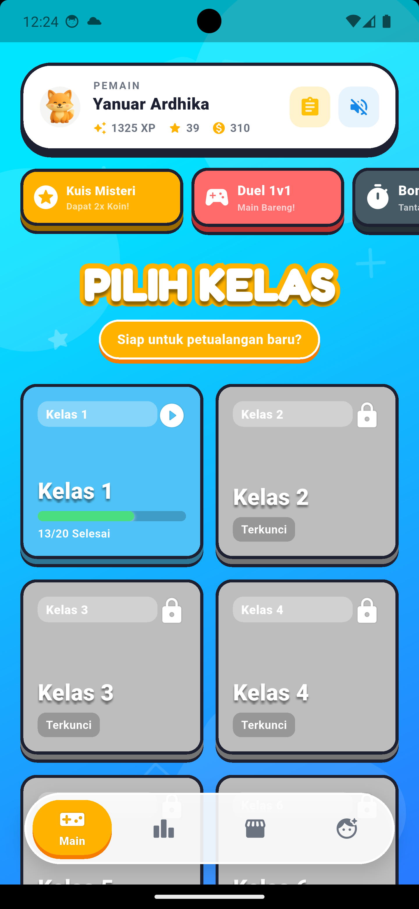

# 🚀 Jago Hitung

**Jago Hitung** adalah aplikasi game edukasi matematika interaktif yang dirancang khusus untuk anak Sekolah Dasar (SD) Kelas 1 hingga 6. Dibangun dengan framework **Flutter** dan **Firebase**, aplikasi ini menggabungkan pembelajaran matematika dengan elemen *gamifikasi* (bermain sambil belajar) agar anak-anak tidak mudah bosan dan terus termotivasi untuk belajar.



---

## ✨ Fitur Utama

Aplikasi ini tidak hanya menyajikan soal matematika biasa, tetapi dilengkapi dengan fitur-fitur seru ala *mobile game*:

- 🔐 **Autentikasi Aman:** Sistem *Login* dan *Register* menggunakan Firebase Auth.
- 🎓 **Materi Sesuai Kelas (1-6 SD):** Kurikulum materi mulai dari Penjumlahan, Pengurangan, Perkalian, Pembagian, hingga Pecahan yang disesuaikan per kelas.
- 🪙 **Sistem Koin & XP (Experience Points):** Pemain mendapatkan Koin dan XP setiap kali berhasil menyelesaikan kuis. XP digunakan untuk naik kelas, koin digunakan untuk berbelanja.
- 🛍️ **Toko Avatar:** Koin yang dikumpulkan dapat digunakan untuk membeli stiker avatar keren di dalam *Shop*.
- 🎡 **Roda Keberuntungan Harian (*Daily Spin Wheel*):** Bonus koin gratis setiap kali pemain *login* pertama kali pada hari tersebut.
- 🔥 **Runtutan Harian (*Daily Streak*):** Mendorong anak untuk rajin belajar setiap hari agar apinya tidak padam!
- 🏆 **Papan Peringkat (*Leaderboard*):** Bersaing dengan pemain lain secara global berdasarkan total XP yang diraih.
- 📱 **Desain Responsif:** Tampilan yang sangat rapi dan proporsional, baik saat dimainkan di *Handphone* maupun di *Tablet* layar lebar.
- 🎵 **Audio Interaktif:** Dilengkapi musik latar (BGM) dan efek suara (*Sound Effects*) layaknya game profesional.

## 🎮 Mode Permainan

1. **📚 Mode Belajar/Topik:** Mode utama untuk menyelesaikan misi per materi.
2. **💣 Mode Bom Waktu:** Latih kecepatan menghitung! Jawab soal sebanyak-banyaknya sebelum bom meledak.
3. **⚔️ Mode Duel (1v1):** Main berdua dalam 1 perangkat (layar terbelah/ *split screen*) untuk beradu cepat menjawab soal.

---

## 🛠️ Teknologi yang Digunakan

- **Frontend:** Flutter (Dart)
- **Backend & Database:** Firebase (Firestore)
- **Authentication:** Firebase Auth
- **Audio:** `audioplayers` package
- **State Management:** `setState` & `StreamBuilder`

---

## 🚀 Cara Menjalankan Aplikasi Lokal

1. **Clone repositori ini:**
   ```bash
   git clone https://github.com/username-anda/jago-hitung.git
   cd jago_hitung
   ```
2. **Install dependensi (packages):**
   ```bash
   flutter pub get
   ```
3. **Siapkan Firebase:**
   - Proyek ini membutuhkan Firebase agar fitur Auth dan Leaderboard berjalan.
   - Pastikan Anda sudah menjalankan `flutterfire configure` dan menghubungkannya dengan proyek Firebase Anda.
4. **Jalankan Aplikasi:**
   ```bash
   flutter run
   ```

---
*Dibuat dengan ❤️ untuk mencerdaskan anak bangsa!*
